

  <!--  -->

# ZoteroClaw

**OpenClaw For Zotero**

# Features

- **AI Chat Interface**: Chat with an AI assistant about your PDF documents
- **PDF Reference**: Easily reference the current PDF being viewed
- **File Attachments**: Upload files and attach them to your messages
- **Markdown Rendering**: Supports markdown formatting in AI responses
- **Streaming Responses**: Real-time streaming of AI responses
- **Session Management**: Persistent chat sessions stored across Zotero restarts
- **Connection Status**: Visual indicator for WebSocket connection state
- **History Loading**: Load and review previous chat history

# Support

- **Windows**: Supported
- **macOS**: Not Support Currently
- **Linux**: Not Support Currently

# How to Use

## Download XPI File

Download the latest `.xpi` file from the [Releases](https://github.com/windfollowingheart/zotero-claw/releases) page and install it in Zotero.

[github](https://github.com/windfollowingheart/zotero-claw/releases/download/v1.0.0/zotero-claw.xpi)
[gitee](https://gitee.com/windheartyolo/zotero-claw/releases/download/v1.0.0/zotero-claw.xpi)

## Download Backend Binary File

Download the backend service binary file [zotero-claw.exe](https://gitee.com/windheartyolo/zotero-claw/releases/download/backend_binary_file/zotero-claw.exe)

## Execute Backend Binary File

  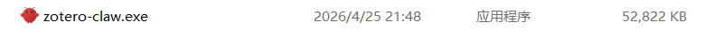

### Settings Backend Service

Click the Settings button to configure the backend service.

  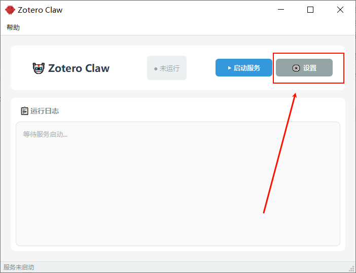

LLM Configuration should be set up before starting.

  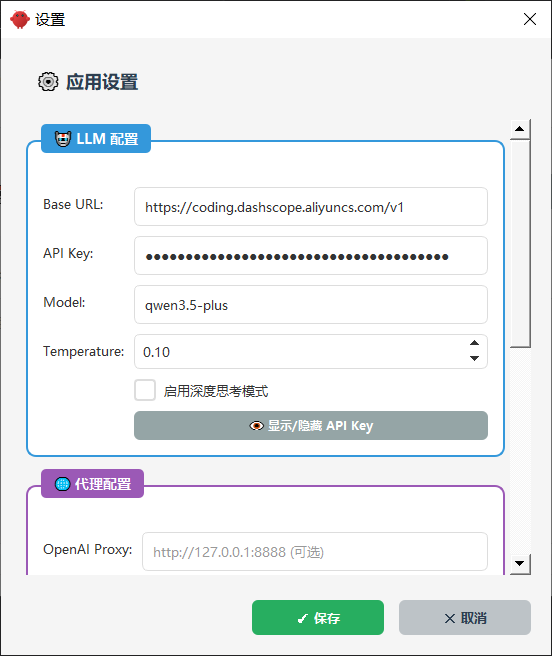

### Start The Backend Service

Click the Start Service button to start the backend service.

  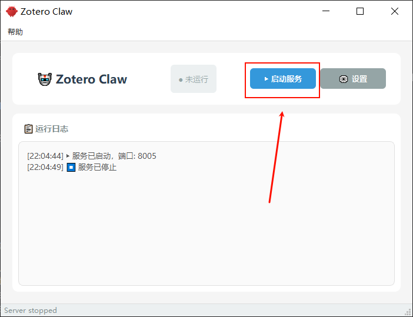

  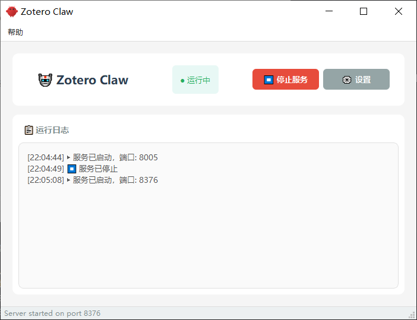

## Execute Zotero Plugin

if the backend service is running before execute the plugin, the plugin will connect and load history automatically.

  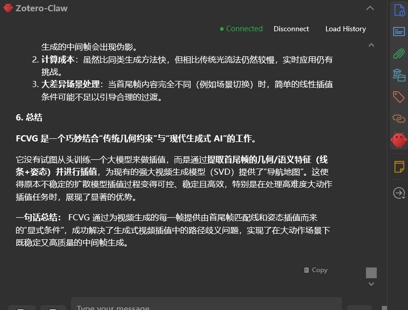

if the backend service is not running, the plugin will be disconnected. You can click the Connect button to connect the plugin.

  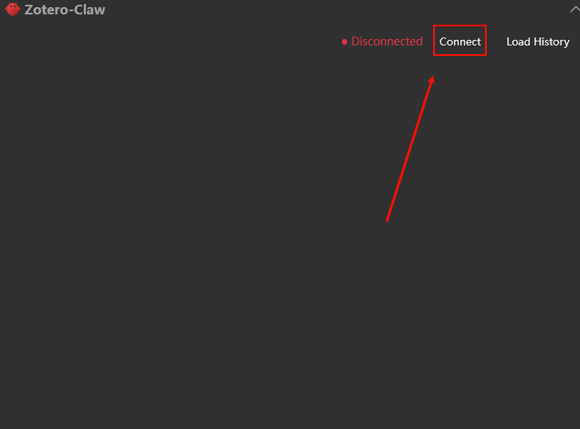

Then the plugin will be connected and the history will be loaded automatically.

  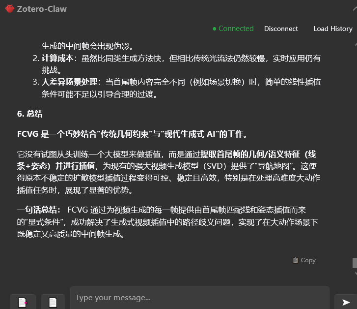

## Chat with PDF

You can chat with the PDF attachment. Upload the PDF by:

1. Send PDF which is open in the Zotero Reader
2. Upload PDF file from your file system

  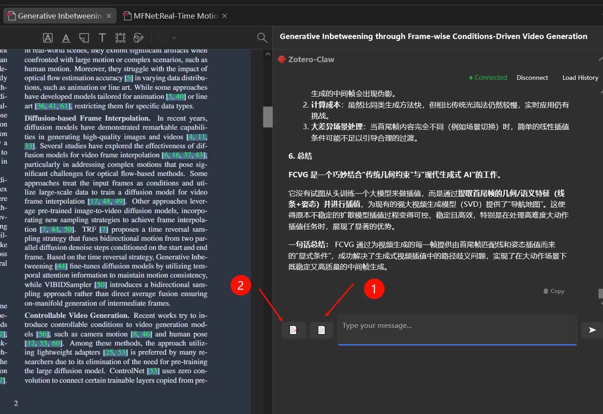

Then you can chat with ZoteroClaw about the PDF document.

  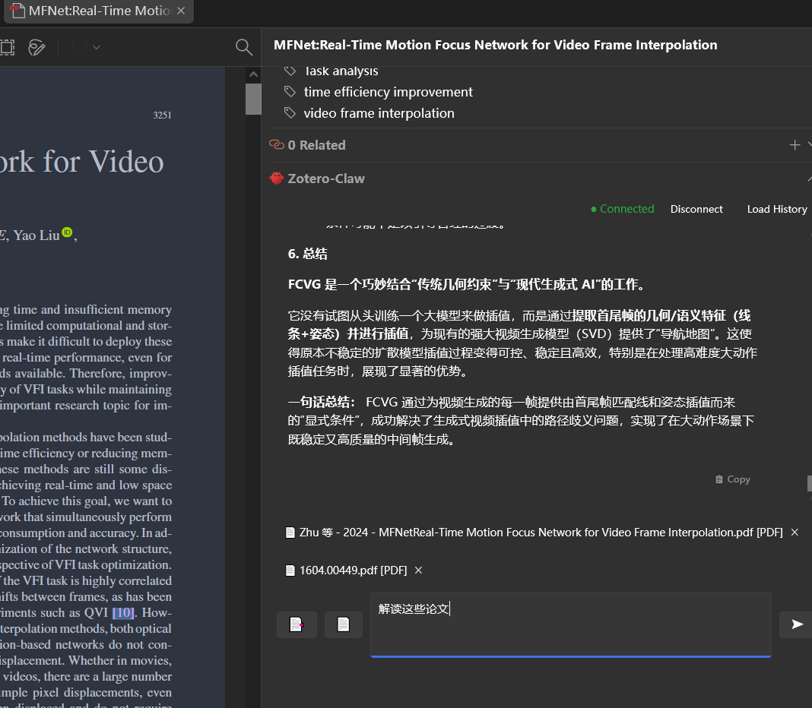

  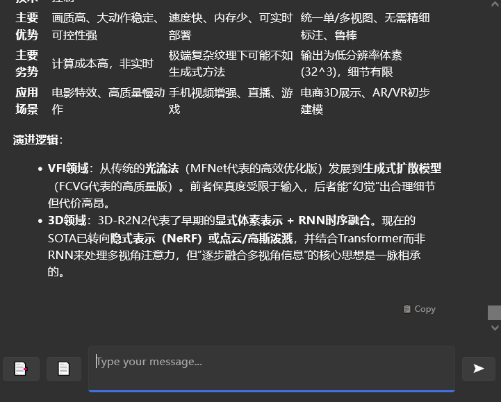

# Thanks

- [Zotero Plugin Template](https://github.com/windingwind/zotero-plugin-template) - The foundation for this plugin
